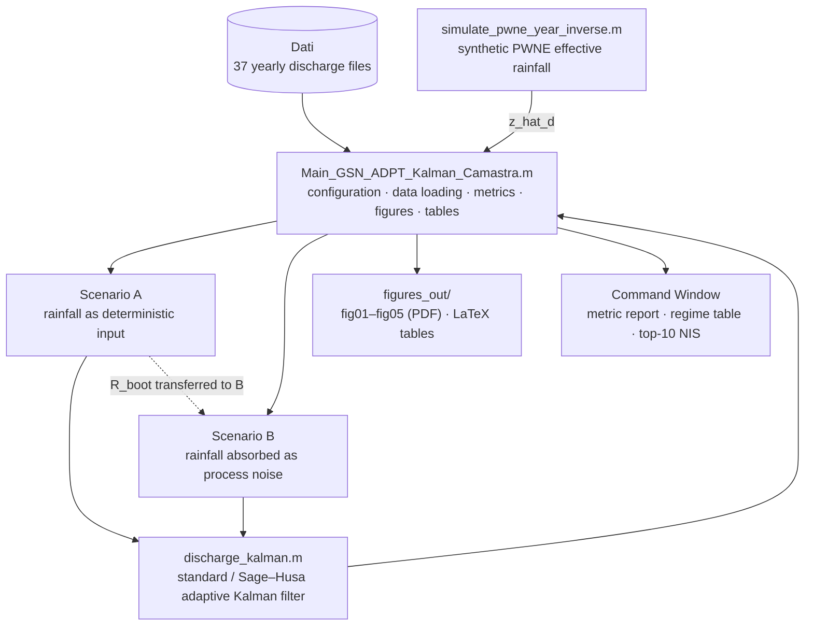

# GSN-Adaptive-Kalman-Streamflow

## Adaptive Kalman filtering for Generalized Shot Noise streamflow models, with application to the Camastra basin

This repository contains the MATLAB code used to estimate daily discharge
with an adaptive Kalman filter built on the Generalized Shot Noise (GSN)
streamflow model, applied to 37 years (1984–2020) of daily inflow
observations of the Camastra reservoir, in Basilicata, southern Italy.

In the GSN framework [[2](#murrone-paper), [3](#morlando-paper)] the
effective rainfall is a Poisson White Noise Exponential (PWNE) process and
the catchment response is a superposition of linear exponential
reservoirs. This structure admits an exact discrete-time state-space
representation, on which the filter operates. The measurement and
process-noise covariances are estimated online through a Sage–Husa scheme
[[5](#li-paper)], with separate innovation and posterior-residual buffers,
forgetting weights normalized by the Normalized Innovation Squared (NIS),
and a correction of the process-noise update for the covariance propagated
through the state dynamics. Without that correction the recursion has no
finite stationary point; with it, the expected increment vanishes when the
mean NIS reaches one. The filter also includes a bootstrap initialization
of the measurement-noise variance and a prediction-only treatment of
missing observations.

The Camastra response function and the monthly PWNE parameters are those
calibrated by Cimorelli et al. [[4](#cimorelli-paper)]. Since no rainfall
record temporally matched with the discharge is available, the filter is
run under two configurations: in the first, a synthetic effective-rainfall
realization is supplied as a deterministic input; in the second, the
unresolved forcing is represented through the adaptive process noise. See
[[1](#kalman-paper)] for the full formulation, the theoretical results and
the discussion of the two scenarios.

**Software and code developed by:** Mario Pezzella<br/>
**Version:** 1.0<br/>
**Release date:** September 2026

### Authors

* Mario Pezzella<br/>
  Department of Mathematics and Applications "Renato Caccioppoli"<br/>
  University of Naples Federico II, Naples, Italy<br/>
  and Institute for Applied Mathematics "Mauro Picone" (IAC)<br/>
  National Research Council of Italy, Naples, Italy
* Luigi Cimorelli<br/>
  Department of Civil, Architectural and Environmental Engineering<br/>
  University of Naples Federico II, Naples, Italy
* Luisa D'Amore, Salvatore Cuomo<br/>
  Department of Mathematics and Applications "Renato Caccioppoli"<br/>
  University of Naples Federico II, Naples, Italy

M. Pezzella is the corresponding author.

### Requirements

The code requires **MATLAB R2020a or later**. In its default adaptive
configuration it runs on base MATLAB alone: the few statistical functions
it needs (percentiles, the inverse χ²₁ CDF, the probability integral
transform) are implemented locally, so the Statistics and Machine Learning
Toolbox is not required.

| Toolbox | Used for |
|---|---|
| Control System Toolbox | *optional*, `dare`, the steady-state Riccati solution. Without it a fixed-point iteration of the Riccati recursion is used instead |
| Optimization Toolbox | only with `USE_ADAPTIVE = false`: `fmincon`, `optimoptions`, `createOptimProblem` for the offline calibration of Q and R |
| Global Optimization Toolbox | only with `USE_ADAPTIVE = false`: `MultiStart`, `CustomStartPointSet` |
| Parallel Computing Toolbox | *optional*, `UseParallel` in `MultiStart`. Without it MATLAB runs serially |

To check what is installed on your machine:

```matlab
ver
license('test','Control_Toolbox')
license('test','Optimization_Toolbox')
license('test','GADS_Toolbox')               % Global Optimization
license('test','Distrib_Computing_Toolbox')  % Parallel Computing
```

Everything else (`fzero`, `gammainc`, `readmatrix`, `datetime`,
`tiledlayout`, `exportgraphics`) is part of base MATLAB. The memory
footprint is small: the largest arrays are the per-step state covariances,
of size ns × ns × N with ns = 1 and N = 13515.

### Code structure

The repository is organized around a single driver script, which loads the
data, builds the synthetic rainfall of Scenario A, runs the filter under
both scenarios, and produces all metrics, figures and tables.



Scenario A is run first. In adaptive mode, its bootstrap estimate of the
measurement-noise variance, `R_boot`, initializes the measurement variance
of Scenario B (dashed arrow), for which the bootstrap is disabled. The
measurement variance is a property of the gauge, independent of the
process-noise model, which is what makes the transfer consistent.

### How to run

Clone the repository, set MATLAB's current folder to the repository root,
and run

```matlab
Main_GSN_ADPT_Kalman_Camastra
```

The script prints the progress and the full metric report to the Command
Window, opens the figures and exports them to `figures_out/`, which is
created if needed. Nothing else is written to disk, unless
`TABLES_TO_FILE = true`.

The behaviour is controlled by a few flags in Section 0 of the script:

| Flag | Default | Effect |
|---|---|---|
| `USE_ADAPTIVE` | `true` | `true`: Sage–Husa adaptive filter. `false`: standard Kalman filter with Q and R calibrated offline by `MultiStart` so that the mean NIS equals one |
| `EXPORT_FIGURES` | `true` | export the figures to `figures_out/` |
| `FIG_FORMATS` | `{'pdf'}` | export formats, e.g. `{'pdf','png'}` |
| `PRINT_TABLES` | `true` | print the LaTeX tables to the Command Window |
| `TABLES_TO_FILE` | `false` | also write the tables as `\input`-able `.tex` files in `figures_out/` |
| `PLOT_CALIB_DIAG` | `false` | add the supplementary figure of distributional diagnostics |
| `BURN_IN_YEARS` | `5` | years excluded from the post-burn-in metrics |
| `ZOOM_YEARS` | `[2013 2017]` | years shown at daily resolution in fig02 |
| `RNG_SEED` | `30` | seed of the synthetic rainfall realization of Scenario A |

The adaptive configuration requires no optimization. The offline
calibration branch (`USE_ADAPTIVE = false`) runs the filter once per
objective evaluation, from up to 140 start points in Scenario A and 200 in
Scenario B, and is therefore considerably slower.

### Outputs

| File | Content |
|---|---|
| `fig01_timeseries_data_scenA_scenB` | Full record: observations, and filtered estimates ± 1.96 σ for Scenario A and Scenario B |
| `fig02_hydrograph_zoom` | Daily hydrograph for the two `ZOOM_YEARS`, observations and both filtered estimates |
| `fig03_relerror_scenA_scenB` | Pointwise relative error \|q̂ − y\| / max(y, 1), scenarios × pre/post update, with median, mean and 90th percentile |
| `fig04_monthly_RMSE_bias` | Monthly RMSE and bias of the filtered and predicted discharge, all years pooled by calendar month |
| `fig05_adaptive_R_Qd` | Online adaptation of R<sub>n</sub> and Q<sub>d,n</sub>, with the bootstrap estimate transferred to Scenario B (adaptive mode only) |
| `figS1_calibration_diagnostics` | PIT histogram, reliability diagram, NIS QQ-plot against χ²₁ (only with `PLOT_CALIB_DIAG = true`) |

The Command Window report contains the accuracy metrics (RMSE, MAE, NSE,
relative-error statistics) for both the filtered estimate q̂<sub>n|n</sub>
and the one-step-ahead prediction q̂<sub>n|n−1</sub>, the NIS statistics,
the predictive-band coverage at the 50, 90, 95 and 99% nominal levels, the
same metrics after the burn-in years, the regime-conditional metrics of
Scenario B (wet season, dry season, low and high flows), and the ten
largest NIS values with their dates. Three LaTeX tables are generated from
the same variables: `tab_results`, `tab_regime` and `tab_events`.

### Scenarios and notation

The two scenarios differ only in how the effective rainfall enters the
state equation x<sub>n+1</sub> = A<sub>d</sub> x<sub>n</sub> + u<sub>n</sub> + w<sub>n</sub>:

| | Scenario A | Scenario B |
|---|---|---|
| Rainfall | synthetic PWNE realization `z_hat_d`, deterministic input | not supplied |
| Input u<sub>n</sub> | exact integral of a rectangular pulse | 0 |
| Initial Q<sub>d</sub> | diagonal Q<sub>d</sub><sup>(A)</sup> from spectral densities q<sub>j</sub> | Q<sub>d</sub><sup>(B)</sup> from the annual mean PWNE spectral constant |
| Feed-through α<sub>0</sub> z | removed before filtering, restored in the output | absent |
| Initial R | bootstrap estimate R<sub>boot</sub> | R<sub>boot</sub> transferred from Scenario A |
| Options struct | `opts_A` | `opts_B` |
| Output struct | `out_A` | `out_B` |

The synthetic rainfall of Scenario A reproduces the calibrated monthly
statistics of the PWNE process, but its individual events are not
synchronized with those that generated the observed discharge. `RNG_SEED`
fixes the realization; Scenario B does not depend on it.

The Camastra model parameters, hard-coded in Section 1 of the script, are
those of the PCSTC calibration [[4](#cimorelli-paper)]:

| Parameter | Code | Value |
|---|---|---|
| Routing fractions α<sub>0</sub>, α<sub>1</sub> | `alpha` | 0.201, 0.799 |
| Reservoir characteristic time k<sub>1</sub> | `k_vec` | 38.431 d |
| Time step Δt | `dt` | 1 d |
| Number of reservoirs n<sub>s</sub> | `ns` | 1 |
| Monthly Poisson rates λ<sub>m</sub> | `lambda_month` | 12 values [1/d], zero from July to September |
| Monthly mean magnitudes η<sub>c,m</sub> | `eta_c_month` | 12 values |

From these, the state-space quantities follow as
A<sub>d</sub> = exp(−Δt/k<sub>1</sub>) and c = α<sub>1</sub>/k<sub>1</sub>.
Throughout the code, the suffixes `_f` and `_p` denote filtered
(post-update) and predicted (pre-update) quantities, and the prefixes
`M_` and `C_` denote metrics over the full record and after the burn-in
years, respectively.

### Software content

* `Main_GSN_ADPT_Kalman_Camastra.m`<br/>
  Driver script. Sets the model parameters, loads the 37 yearly files and
  checks their length against the calendar, generates the Scenario A
  rainfall year by year, configures and runs the filter under both
  scenarios, computes accuracy, consistency and coverage metrics over the
  full record, after the burn-in years and by hydrological regime, and
  produces the figures and the LaTeX tables. In standard mode it also
  performs the offline `MultiStart` calibration of Q and R. All helper
  functions (metrics, percentiles, PIT, table writers, figure export,
  calibration objectives) are local functions at the end of the file.
* `discharge_kalman.m`<br/>
  The Kalman filter for the GSN model, for any number of reservoirs. It
  builds the exact discrete-time system for the selected scenario, runs
  the optional bootstrap estimate of R, solves the discrete algebraic
  Riccati equation for the steady-state gain, and executes the
  predict–update loop in standard mode (fixed Q and R, switch to the
  steady-state gain on convergence) or in Sage–Husa adaptive mode (online
  estimation of R and of the diagonal of Q<sub>d</sub>). Missing
  observations are handled by prediction only. It returns the filtered
  discharge and states, their covariances, innovations, innovation
  variances, NIS and, in adaptive mode, the history of R and Q<sub>d</sub>.
  It can also produce a pure-prediction forecast beyond the end of the
  record, with four choices of drift.
* `simulate_pwne_year_inverse.m`<br/>
  Generates one year of daily effective rainfall from the monthly PWNE
  model by inverse-transform sampling of the compound
  Poisson–exponential distribution of the daily total, whose CDF has an
  atom at zero (dry days) and is inverted numerically with `fzero` on wet
  days.
* `Dati/`<br/>
  The 37 yearly files of daily discharge of the Camastra reservoir,
  together with a `README.md` documenting their format and provenance.
  These are the only inputs to the code.
* `docs/filter_details.md`<br/>
  Extended description of the code: state-space model, the two scenarios,
  the filter loop, the Sage–Husa adaptation and its modifications,
  initialization, and the evaluation metrics.

### Data availability

The daily inflow record of the Camastra reservoir was provided by the
Agency for Development of Irrigation and Land Transformation in Puglia,
Lucania and Irpinia. The files under `Dati/` are the working copy required
to reproduce the results of [[1](#kalman-paper)]; see `Dati/README.md`.

### References

1. <a name="kalman-paper"></a>___Adaptive Kalman Filtering for Streamflow
   Models with Application to the Camastra Basin___<br/>
   M. Pezzella, L. Cimorelli, L. D'Amore, S. Cuomo<br/>
   (2026), submitted.
2. <a name="murrone-paper"></a>___Conceptually-based shot noise modeling of
   streamflows at short time interval___<br/>
   F. Murrone, F. Rossi, P. Claps<br/>
   Stochastic Hydrology and Hydraulics, 1997, 11: 483–510.<br/>
   [DOI: 10.1007/BF02428430](https://doi.org/10.1007/BF02428430)
3. <a name="morlando-paper"></a>___Shot noise modeling of daily streamflows:
   A hybrid spectral- and time-domain calibration approach___<br/>
   F. Morlando, L. Cimorelli, L. Cozzolino, G. Mancini, D. Pianese,
   F. Garofalo<br/>
   Water Resources Research, 2016, 52: 4730–4744.<br/>
   [DOI: 10.1002/2015WR017613](https://doi.org/10.1002/2015WR017613)
4. <a name="cimorelli-paper"></a>___Sedimentation in Reservoirs: Evaluation
   of Return Periods Related to Operational Failures of Water Supply
   Reservoirs with Monte Carlo Simulation___<br/>
   L. Cimorelli, C. Covelli, A. De Vincenzo, D. Pianese, B. Molino<br/>
   Journal of Water Resources Planning and Management, 2021, 147(1): 04020096.<br/>
   [DOI: 10.1061/(ASCE)WR.1943-5452.0001307](https://doi.org/10.1061/(ASCE)WR.1943-5452.0001307)
5. <a name="li-paper"></a>___Adaptive Kalman Filter for Real-Time Estimation
   with Application to Navigation Systems___<br/>
   Z. Li, B. Guo, J. Yu, Z. Wang, X. Ma<br/>
   Applied Sciences, 2025, 15: 1731.<br/>
   [DOI: 10.3390/app15041731](https://doi.org/10.3390/app15041731)

### Citation

If you use this software, please cite the paper
[[1](https://github.com/MarioPezzella/GSN-Adaptive-Kalman-Streamflow#references)] or,
better, please check there if a final version has been published. Consider
citing also [[4](#cimorelli-paper)] for the calibration of the GSN model of
the Camastra basin.
Please cite this repository as well; a `CITATION.cff` file is provided, so
the "Cite this repository" button on the GitHub page produces a ready-made
entry in BibTeX or APA format.

### License

GSN-Adaptive-Kalman-Streamflow is distributed under the terms of the GNU
GPL v. 3 license (see the attached `LICENSE.md` file).

### Acknowledgements

The authors thank the Agency for Development of Irrigation and Land
Transformation in Puglia, Lucania and Irpinia for providing the Camastra
inflow record.
