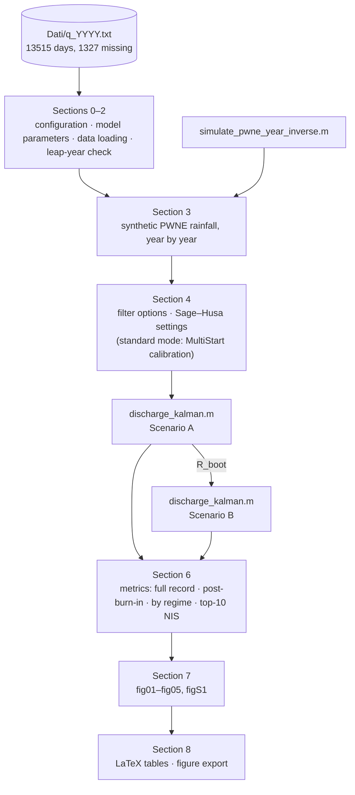

# The adaptive filter and its evaluation

This document describes what the code does and why, at a level of detail
intended for someone who wants to modify it rather than just run it. For
the mathematical formulation, the theoretical results and the discussion of
the application, see the associated manuscript. For the GSN model and its
calibration on the Camastra basin, see Murrone et al., *Stoch. Hydrol.
Hydraul.* 11: 483–510 (1997), Morlando et al., *Water Resour. Res.* 52:
4730–4744 (2016), and Cimorelli et al., *J. Water Resour. Plann. Manage.*
147(1): 04020096 (2021).

## Overview



Each numbered block corresponds to a `%%` cell of
`Main_GSN_ADPT_Kalman_Camastra.m`, so the script can also be executed cell
by cell with *Run Section*. The helper functions are local functions at the
end of the script, as MATLAB requires.

## The model

The GSN model describes the effective rainfall z(t) as a PWNE process, a
sequence of Dirac pulses arriving as a Poisson process of rate λ, with
independent exponential magnitudes of mean η<sub>c</sub>. Its fluctuating
part is white, with spectral constant

```
G = 2 eta_c^2 lambda
```

The catchment responds as a superposition of n<sub>s</sub> linear
reservoirs,

```
h(t) = a0 delta(t) + sum_j (alpha_j / k_j) exp(-t / k_j),    sum(alpha) = 1
```

and introducing the reservoir states
x<sub>j</sub>(t) = ∫ exp(−(t−s)/k<sub>j</sub>) z(s) ds gives the
state-space form

```
dx_j/dt = -x_j / k_j + z(t)
q(t)    = c' x(t) + a0 z(t),        c_j = alpha_j / k_j
```

At statistical equilibrium E[x<sub>j</sub>] = k<sub>j</sub> E[q], which the
code uses to initialize the state.

Over a step Δt the transition is exact:

```
x_{n+1} = Ad x_n + u_n + w_n,       Ad = diag(exp(-dt / k_j))
y_n     = c' x_n + v_n,             v_n ~ N(0, R)
```

For the Camastra basin n<sub>s</sub> = 1, k<sub>1</sub> = 38.431 d,
α<sub>0</sub> = 0.201, α<sub>1</sub> = 0.799, Δt = 1 d, so that
A<sub>d</sub> = 0.9744 and c = 0.02078 d<sup>−1</sup>. The code, however,
is written for any n<sub>s</sub>: `ns` is inferred from `numel(k_vec)`.

## The two scenarios

The scenarios differ in how the rainfall enters u<sub>n</sub> and
w<sub>n</sub>. They are selected by `opts.scenario` in `discharge_kalman`.

**Scenario A — rainfall as a deterministic input.** A rainfall sequence
`z_hat_d` is treated as a rectangular pulse of rate
ẑ<sub>n</sub>/Δt over each step, whose exact integration gives

```
u_n(j) = z_hat_d(n) k_j (1 - exp(-dt / k_j)) / dt          (build_U_rect)
```

The remaining model error is additive noise with diagonal covariance

```
Qd_jj = q_j k_j / 2 (1 - exp(-2 dt / k_j))
```

built from the spectral densities `opts.Q_diag`. The instantaneous term
α<sub>0</sub> z does not pass through the reservoirs, so it is subtracted
from the observations before filtering, `y_corr = y - a0*z_hat_d`, and
added back to the filtered discharge at the end. In the driver script,
`z_hat_d` is a Monte Carlo realization of the monthly PWNE model generated
by `simulate_pwne_year_inverse`; `RNG_SEED` fixes it.

**Scenario B — rainfall absorbed as process noise.** No rainfall is
supplied, u<sub>n</sub> = 0, and the whole fluctuating forcing is
represented by the exact discretization of the rank-one continuous
covariance G **b** **b**′,

```
Qd_ij = G k_i k_j / (k_i + k_j) (1 - exp(-(1/k_i + 1/k_j) dt))    (build_Qd_B)
```

The driver uses the annual mean of the monthly spectral constants
G<sub>m</sub> = 2 η<sub>c,m</sub>² λ<sub>m</sub>, re-expressed in the
unit-rate parametrization λ<sub>B</sub> = 1,
η<sub>c,B</sub> = √(Ḡ/2). In adaptive mode this matrix is only the
starting point of the adaptation.

## Generating the synthetic rainfall

`simulate_pwne_year_inverse` samples each day independently. The daily
total of a compound Poisson–exponential process has a CDF with an atom at
zero,

```
F(0) = exp(-lambda dt)
F(z) = exp(-lambda dt) + sum_{nu >= 1} Pois(nu; lambda dt) P(nu, z / eta_c),   z > 0
```

where P(ν, ·) is the regularized lower incomplete gamma function. A uniform
number r is drawn: if r ≤ F(0) the day is dry, otherwise F(z) = r is solved
with `fzero` on a bracket that is doubled until it contains the root. The
series is truncated when its terms drop below 10<sup>−12</sup>. For the
three months with λ<sub>m</sub> = 0 every day is dry, and the corresponding
η<sub>c,m</sub> is never used.

## The filter loop

`discharge_kalman` runs the loop in the order predict → update, with
`x_cur` holding x<sub>n−1|n−1</sub> at the start of step n. This ordering
makes a warm start exact: passing `opts.x0 = x_{N|N}` and
`opts.P0 = P_{N|N}` continues a run seamlessly.

A missing observation triggers the prediction only: the state and the
covariance are propagated, the gain is zero, and in adaptive mode no noise
statistic is updated and the posterior residual is marked as unavailable.

The posterior covariance is always computed in Joseph form,

```
P_{n|n} = (I - K c') P_{n|n-1} (I - K c')' + K R K'
```

which keeps it symmetric and positive semi-definite in finite precision.

### Standard mode

With `opts.adaptive = false`, Q and R are fixed. The steady-state gain
K<sub>∞</sub> is computed from the discrete algebraic Riccati equation
(`dare_sym`, which calls `dare` when the Control System Toolbox is
available and otherwise iterates the Riccati recursion to a fixed point).
The filter runs with the time-varying gain until
‖K<sub>n</sub> − K<sub>∞</sub>‖/‖K<sub>∞</sub>‖ < `gain_tol` for
`gain_patience` consecutive steps, and then switches permanently to
K<sub>∞</sub>. The default initialization is diffuse, x<sub>0</sub> = 0 and
P<sub>0</sub> = 10<sup>4</sup>(Q<sub>d</sub> + R I).

In the driver, standard mode is paired with an offline calibration
(`USE_ADAPTIVE = false`): the parameters are searched in log<sub>10</sub>
scale by `MultiStart`/`fmincon`, minimizing
(mean NIS − 1)² plus a negligible tie-break penalty on mean(log S). In
Scenario A both q and R are calibrated, in Scenario B only R, since
Q<sub>d</sub><sup>(B)</sup> is fixed by the PWNE parameters.

### Sage–Husa adaptive mode

With `opts.adaptive = true`, R and the diagonal of Q<sub>d</sub> are
updated at every step with a valid observation. The comments in
`discharge_kalman.m` label the steps (I)–(X); in summary:

1. *Before the prediction*, the forgetting weight d<sub>1</sub> is
   computed from the buffer of prior NIS values, and R is updated with the
   posterior residual of the previous step,
   ```
   R_n = (1 - d1) R_{n-1} + d1 (delta_{n-1}^2 + c' P_{n-1|n-1} c)
   ```
   which is unbiased at consistency and positive by construction.
2. *Prediction and update* follow, with the innovation ε<sub>n</sub>, its
   variance S<sub>n</sub> = c′P<sub>n|n−1</sub>c + R<sub>n</sub>, the gain
   and the posterior residual δ<sub>n</sub>.
3. *After the update*, the forgetting weight d<sub>2</sub> is computed from
   the buffer of posterior NIS values, before δ<sub>n</sub> is appended, and
   the Q<sub>d</sub> diagonal is updated,
   ```
   Qd_jj = (1 - d2) Qd_jj + d2 (K_j^2 eps_n^2 + P_{n|n,jj} - Ad_jj^2 P_{n-1|n-1,jj})
   ```
   and projected onto `[sage_Q_min, sage_Q_max]`. Finally, both buffers
   receive the new values ε<sub>n</sub>²/S<sub>n</sub> and
   δ<sub>n</sub>²/S<sub>n</sub>.

The forgetting weights have the form

```
L = -mean(buffer),    b = lambda_min + (1 - lambda_min) 2^L,    d = (1 - b) / (1 - b^n)
```

with b clamped to [λ<sub>min</sub>, 1 − 10<sup>−9</sup>]. Only the diagonal
of Q<sub>d</sub> is adapted, so after the first update Q<sub>d</sub> is
diagonal; for n<sub>s</sub> = 1 this is no restriction. The driver uses
λ<sub>min</sub> = 0.95 and buffers of 180 days (`sage_window = 30*6`).

Four modifications adapt the scheme to discharge data and slow reservoir
dynamics. They are documented in the header of `discharge_kalman.m`:

| # | Modification | Why |
|---|---|---|
| 1 | Buffers store NIS values ε²/S rather than raw squared residuals | with residuals in m³/s, 2<sup>L</sup> ≈ 0 and b would sit at λ<sub>min</sub> regardless of the state of the filter; the NIS is scale-free and close to 1 at consistency |
| 2 | The Q update subtracts A<sub>d,jj</sub>² P<sub>n−1\|n−1,jj</sub> | otherwise the covariance propagated through the dynamics is counted as new noise; with k = 38.4 d, P<sub>ss</sub> ≈ 20 Q<sub>d</sub> and the recursion has no finite stationary point. With the correction, the steady-state increment is K<sub>j</sub>² S (NIS − 1) |
| 3 | No covariance-matching step | inflating R whenever ε² > S would multiply R geometrically, since P(NIS > 1) ≈ 31.7% even for a consistent filter |
| 4 | Bootstrap estimate of R and equilibrium initialization | a large initial R is a fixed point of the R update; see below |

The uncorrected Q update of modification 2 is retained in the code as a
commented line, for comparison.

## Initialization

**Bootstrap of R.** When R<sub>0</sub> ≫ R the gain is nearly zero, the
posterior residual coincides with the innovation, and the adaptive R update
stays at R<sub>0</sub>. Unless `opts.P0` is supplied, the adaptive mode
therefore first runs `sage_bootstrap` standard Kalman steps with the
preliminary R, starting from the stationary mean and the steady-state
covariance, and estimates

```
R_boot = max( mean(eps^2) - mean(c' P_pred c), R_min )
```

which is unbiased for any gain, since E[ε²] = c′P<sub>pred</sub>c + R. The
estimate is accepted only if at least 10 valid observations were used.

**Equilibrium start.** The adaptive filter then starts from
x<sub>0</sub> = mean(y) k and P<sub>0</sub> = P<sub>ss</sub>(R<sub>boot</sub>),
the posterior steady state of the DARE, so that the first gain is already
K<sub>∞</sub>. Both NIS buffers are pre-filled with ones, which gives a
small, finite forgetting weight from the first step.

**Transfer of R to Scenario B.** Under Scenario B, Q<sub>d</sub><sup>(B)</sup>
encodes the whole rainfall uncertainty, the prior variance over the
bootstrap window is large, and the subtraction in the estimator turns
negative. The driver therefore sets `opts_B.sage_bootstrap = 0` and
initializes R of Scenario B with the bootstrap estimate of Scenario A,
`R_boot_A`. The transfer is consistent because R describes the gauge, not
the process-noise model.

## Outputs of the filter

The output struct of `discharge_kalman` is documented in the header of the
function. Two points deserve attention when using it.

`q_sigma` is the standard deviation of the state estimate,
√(c′P<sub>n|n</sub>c). It is the band shown in the figures, but it is not
the predictive spread of an observation. The predictive variance of
y<sub>n</sub> is `S`.

`filter_params` stores the settings at the end of the run: the final R,
the final Q<sub>d</sub> converted back to spectral densities, and the
adaptation parameters with the bootstrap disabled. Together with
`x_filt(:,end)` and `P_filt(:,:,end)` it provides what is needed to
continue filtering on a later batch of data.

`discharge_kalman` can also forecast beyond the record (`opts.t_fore`),
propagating the last posterior without updates, with drift given by free
decay, a known rainfall sequence, the constant PWNE mean, or the seasonal
PWNE mean (`fore_option` 0–3). The driver script does not use this option.

## Evaluation

All metrics are computed by `full_metrics` over a logical mask of valid
days.

**Filtered and predicted estimates.** Every accuracy metric is computed
twice: for the filtered estimate q̂<sub>n|n</sub> (`_f`) and for the
one-step-ahead prediction q̂<sub>n|n−1</sub> (`_p`). The prediction is not
a separate filter output: since `innov` = y − c′x<sub>n|n−1</sub>, the
code uses q̂<sub>n|n−1</sub> = y − `innov`. The difference between the two
isolates the contribution of the measurement update.

**Accuracy.** RMSE, MAE, bias, the Nash–Sutcliffe efficiency
NSE = 1 − MSE/var(y), and the median, mean and 90th percentile of the
relative error |q̂ − y|/max(y, 1), whose denominator is floored at
1 m³/s (`REL_ERR_FLOOR_Q`) to avoid disproportionate values at near-zero
summer flows.

**Consistency.** Mean, median and maximum of the NIS, and the fractions of
NIS values above the χ²₁ critical values at 95% and 99%.

**Coverage.** The predictive band q̂<sub>n|n−1</sub> ± z<sub>p</sub>√S<sub>n</sub>
contains y<sub>n</sub> exactly when NIS<sub>n</sub> ≤ z<sub>p</sub>², so
coverage is computed directly from the NIS at the 50, 90, 95 and 99%
levels. The posterior band q̂<sub>n|n</sub> ± z<sub>p</sub>R<sub>n</sub>/√S<sub>n</sub>
defines the same event, since δ<sub>n</sub> = (R<sub>n</sub>/S<sub>n</sub>)ε<sub>n</sub>;
the code verifies this numerically (`cov95_alt`). A coverage built on
`q_sigma` is also reported for reference, together with its inflation
factor with respect to the posterior scale.

**Burn-in.** The same metrics are recomputed excluding the first
`BURN_IN_YEARS` years (prefix `C_`), to separate the initialization
transient of the adaptation from the long-run behaviour.

**Regimes.** For Scenario B the metrics are also computed on four subsets:
wet season (November–April), dry season (June–September), low flows
(below the median) and high flows (above the 90th percentile). The
distinction matters because the record is not homogeneous: with
λ<sub>m</sub> = 0 from July to September the dry-season response is a
deterministic recession, the innovations are tiny and the NIS tends to
zero, while the largest innovations concentrate on storm-driven days.

**Largest NIS values.** The ten largest NIS values of Scenario B are listed
with their dates, the observed and filtered discharge and the error, to
show where in the record the departures from consistency occur.

**Distributional diagnostics.** With `PLOT_CALIB_DIAG = true`, figS1 adds
the PIT histogram of the signed standardized innovation, the reliability
diagram of the predictive band, and the QQ-plot of the NIS against χ²₁.
The PIT is computed from the signed innovation rather than from the NIS:
folding would map over-dispersion and over-confidence onto the same end of
[0, 1]. All three diagnostics are toolbox-free.

## Reproducibility notes

* The only random component is the synthetic rainfall of Scenario A,
  fixed by `RNG_SEED`. In standard mode the MultiStart start points also
  include random draws, generated after the rainfall with the same seeded
  generator.
* The figure filenames are paired with the figure handles as the figures
  are created (`FIGS`), so the export does not depend on the order of
  creation or on figures left open from previous sessions.
* The script starts with `clear; clc; close all;`. Save any workspace
  variables you need before running it.
